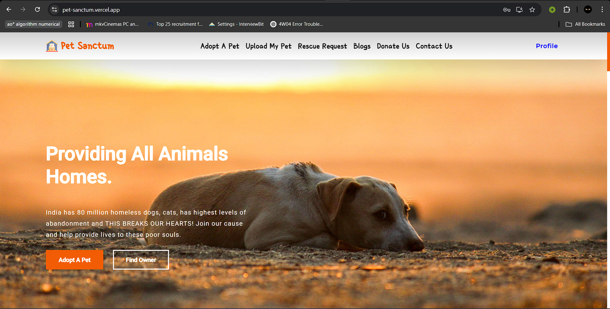
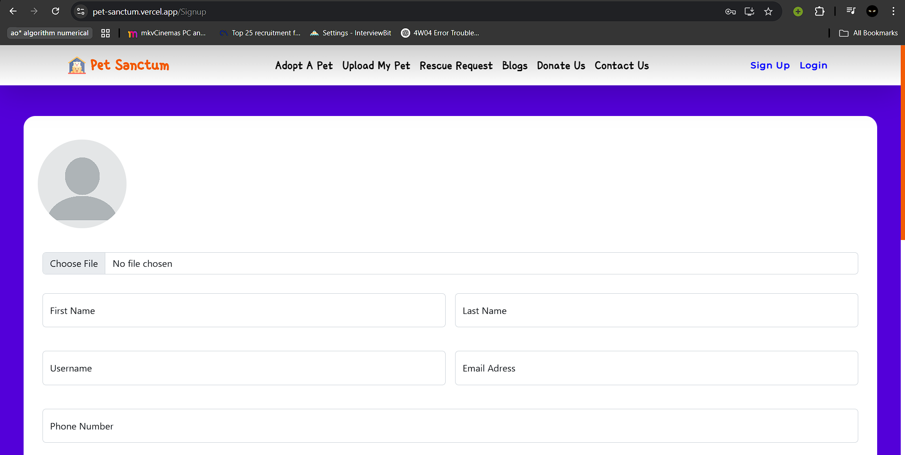
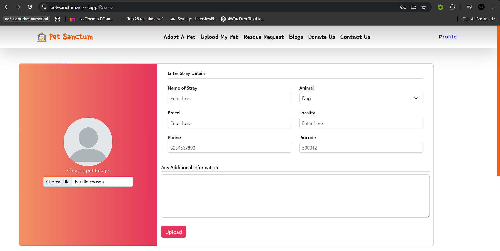
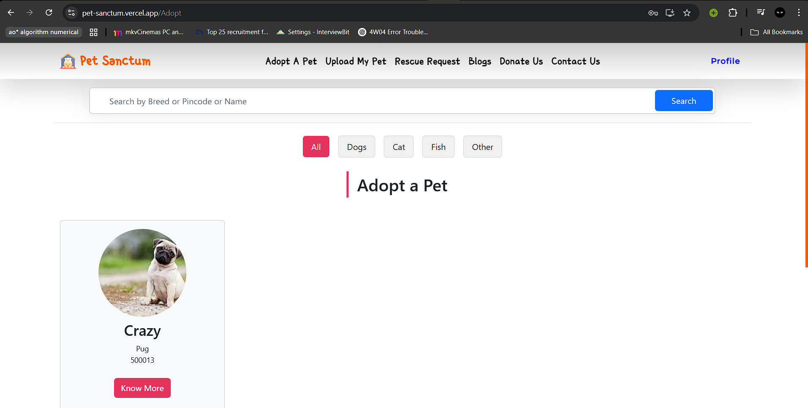

<<<<<<< HEAD
Project Title- Pet Sanctum
Pet Sanctum is a pet adoption website.

This is a full-stack website made using React that helps users adopt pet animals from the website and at the same time allows users to upload their pet information if they wish to abandon their pet and also apply for the rescue of stray animals.

To install all the node modules, type the following command-
npm install

To run the JSON server, run the following command-
json-server --watch ./src/database/database.json

To run the react app, type the following command-
npm start

If on running the react application, it asks to run the application on a port other than 3000, allow it to do so by typing yes.

=======
# 🐾 Pet Sanctum

**Pet Sanctum** is a full-stack web application designed to facilitate **pet adoption and rescue**. It allows users to sign up, browse adoptable pets, manage their profiles, and share blogs about pet care. Admins can manage users, pets, and blog content — making the platform both community- and mission-driven.

---

## 🔗 Live Demo

- 🌐 **Backend (Render)**: [https://pet-sanctum-3eph.onrender.com](https://pet-sanctum-3eph.onrender.com)
- 🌐 **Frontend (Vercel)**: _Add your Vercel frontend URL here after deployment_

---

## 📸 Screenshots

### 🏠 Homepage


### 📝 Sign Up Page


### 🆘 Rescue Request Page


### 🐾 Adopt Page



---

## ⚙️ Tech Stack

### 💻 Frontend
- React.js
- React Bootstrap
- Axios
- React Router DOM
- Toastify

### 🖥 Backend
- Node.js
- Express.js
- MongoDB Atlas (with Mongoose)
- Cloudinary (for image uploads)
- Multer (for handling files)
- CORS, Morgan, Body-Parser
- Swagger (API documentation)

### 🛠 Tools & Hosting
- **Frontend**: Vercel  
- **Backend**: Render  
- **Database**: MongoDB Atlas  
- **Storage**: Cloudinary  
- **Version Control**: Git & GitHub

---

## 🔐 Features

- ✅ User signup & login with profile picture
- 🐶 List pets for adoption / rescue
- 📝 Blog system for community stories
- 📤 Image upload using Cloudinary
- 🔒 Admin dashboard to manage users/pets/blogs
- 📘 Interactive API docs via Swagger at `/api-docs`

---

## 📁 Environment Variables

### 🔧 Backend (`server/.env`)

```env
PORT=8000
MONGODB_URI=mongodb+srv://<username>:<password>@cluster0.mongodb.net/petsanctum?retryWrites=true&w=majority
CLOUDINARY_CLOUD_NAME=your_cloudinary_cloud_name
CLOUDINARY_CLOUD_KEY=your_cloudinary_api_key
CLOUDINARY_SECRET=your_cloudinary_api_secret
```
### 🔧 Frontend (`client/.env`)

```env
REACT_APP_SERVER_LINK=http://localhost:8000
>>>>>>> 7283199bd389b3ef0764582f4d4d113715752c85
